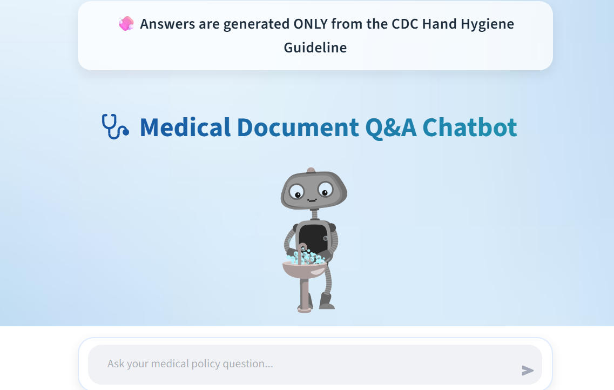

# 🩺 Medical Document Q&A Chatbot

An AI-powered chatbot that allows users to ask questions directly from the **CDC Hand Hygiene Guideline** document.

This project was built using **Streamlit** for the user interface, **LangChain** for intelligent document retrieval, and **OpenAI** for generating accurate, context-based responses.

---
## 🖥️ Virtual Machine (VM) Environment

This project was also tested in a **Virtual Machine (VM) environment** to ensure isolation, reproducibility, and cross-platform compatibility.(Venv)

## ✨ Features

- ✅ Ask questions about medical hand hygiene guidelines
- ✅ Answers generated ONLY from the uploaded document
- ✅ Modern animated UI with background and robot
- ✅ Typing animation for responses
- ✅ Built with Streamlit + LangChain + FAISS + OpenAI
- ✅ Deployed on Streamlit Cloud

---

## 🛠️ Tech Stack

- Python
- Streamlit
- LangChain
- FAISS
- OpenAI API
- PyPDF
- HTML / CSS
- GitHub + Streamlit Cloud

---
## ▶️ How to Run Locally

1. Clone this repository
2. Install dependencies:
   pip install -r requirements.txt
---
## 🔐 API Key & Security Notice

This project uses the OpenAI API to generate intelligent, context-based responses.

For security reasons, **no API key is included in this repository**.

If you want to run this project, you must provide **your own API key** by adding it to a local `.env` file or through Streamlit Secrets.

---
## 📚 References

   **CDC – Guideline for Hand Hygiene in Health-Care Settings (2002)**  
   https://www.cdc.gov/infectioncontrol/pdf/guidelines/hand-hygiene.pdf

